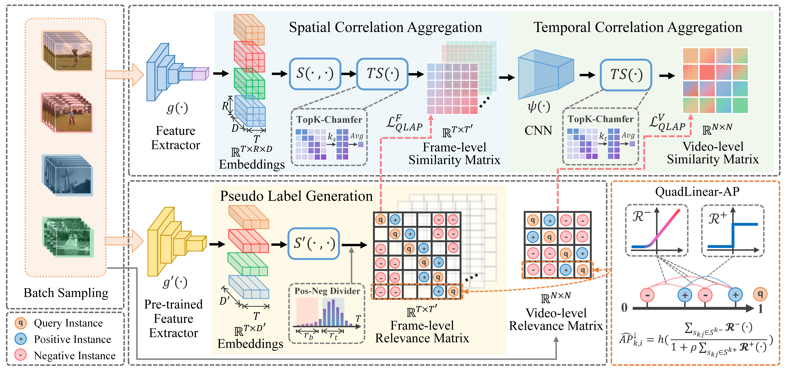

# HAP-VR
[ACMMM 2024] PyTorch implementation of HAP-VR, introduced in "Not All Pairs are Equal: Hierarchical Learning for Average-Precision-Oriented Video Retrieval".

## Introduction

## Training

## Evaluation

## Results

## Citation
