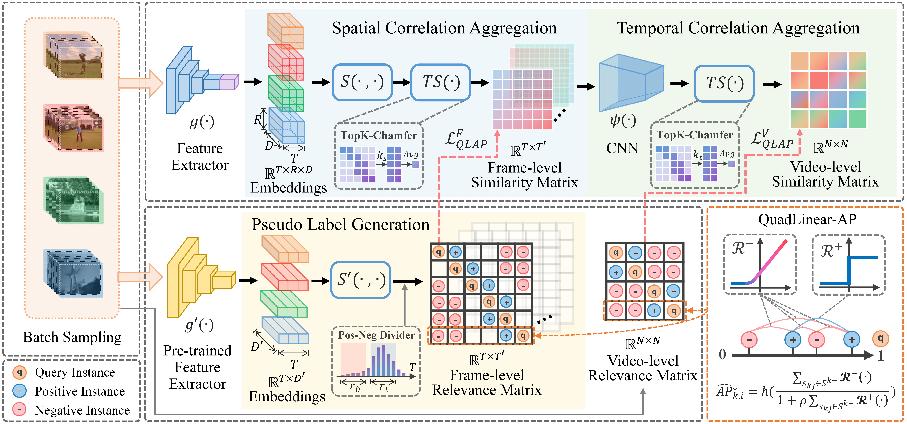

# HAP-VR
This is the official code for the paper "Not All Pairs are Equal: Hierarchical Learning for Average-Precision-Oriented Video Retrieval" accepted by ACM Multimedia (ACMMM 2024). This paper is available at [**here**]().

[](https://arxiv.org/abs/2405.09321) [](https://github.com/huacong/ReconBoost) [](https://github.com/huacong/ReconBoost) [](https://github.com/huacong/ReconBoost)

**Paper Title: Not All Pairs are Equal: Hierarchical Learning for Average-Precision-Oriented Video Retrieval**

**Authors: [Yang Liu](https://yafeng19.github.io/),  [Qianqian Xu*](https://qianqianxu010.github.io/), [Peisong Wen](https://scholar.google.com.hk/citations?user=Zk2XLWYAAAAJ&hl=zh-CN&oi=ao), [Siran Dai](https://scholar.google.com.hk/citations?user=_6gw9FQAAAAJ&hl=zh-CN&oi=ao), [Qingming Huang*](https://people.ucas.ac.cn/~qmhuang)**   



## :computer: Environments

* **Ubuntu** 20.04
* **CUDA** 12.0
* **Python** 3.7.16
* **Pytorch** 1.13.1+cu117

See `requirement.txt` for others.

## :wrench: Installation

1. Clone this repository

    ```bash
    git clone https://github.com/yafeng19/HAP-VR.git
    ```

2. Create a virtual environment with Python 3.7 and install the dependencies

    ```bash
    conda create --name HAP_VR python=3.7
    conda activate HAP_VR
    ```

3. Install the required libraries

    ```bash
    pip install -r requirements.txt
    ```

## :rocket: Training

#### Dataset

As a self-supervised framework, HAP-VR is trained on the unlabeled subset of  [VCDB](https://fvl.fudan.edu.cn/dataset/vcdb/list.htm) dataset, *i.e.* distractors (~1.1TB). 

After downloading all the videos into a certain directory, execute the following command to process videos into frames at 1 FPS.

```bash
python tools/extract_frames.py
```

#### Scripts

We provide a script with default parameters. Run the following command for training.

```bash
bash scripts/train.sh
```

The well-trained models are saved at [**here**](https://github.com/yafeng19/HAP-VR/ckpt).

## :chart_with_upwards_trend: Evaluation

#### Dataset

In our paper, four benchmarks are adopted for evaluation. We provide extracted features for all datasets and all feature files are in HDF5 format.

- [EVVE](https://mever.iti.gr/distill-and-select/features/evve.hdf5) (9 GB)
- [FIVR-5K](https://mever.iti.gr/distill-and-select/features/fivr_5k.hdf5) (8.7 GB)
- [FIVR-200K](https://mever.iti.gr/distill-and-select/features/fivr_200k.hdf5) (406 GB)
- [SVD](https://mever.iti.gr/distill-and-select/features/svd.hdf5) (150 GB)

#### Scripts

We provide a script with default parameters. Run the following command for evaluation.

```bash
bash scripts/eval.sh
```

## :pencil: Citation

If you find this repository useful in your research, please cite the following papers:

```

```

## :email: Contact us

If you have any detailed questions or suggestions, you can email us: liuyang232@mails.ucas.ac.cn. We will reply in 1-2 business days. Thanks for your interest in our work!
